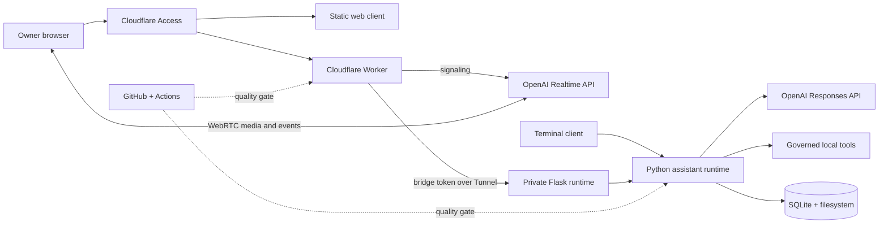
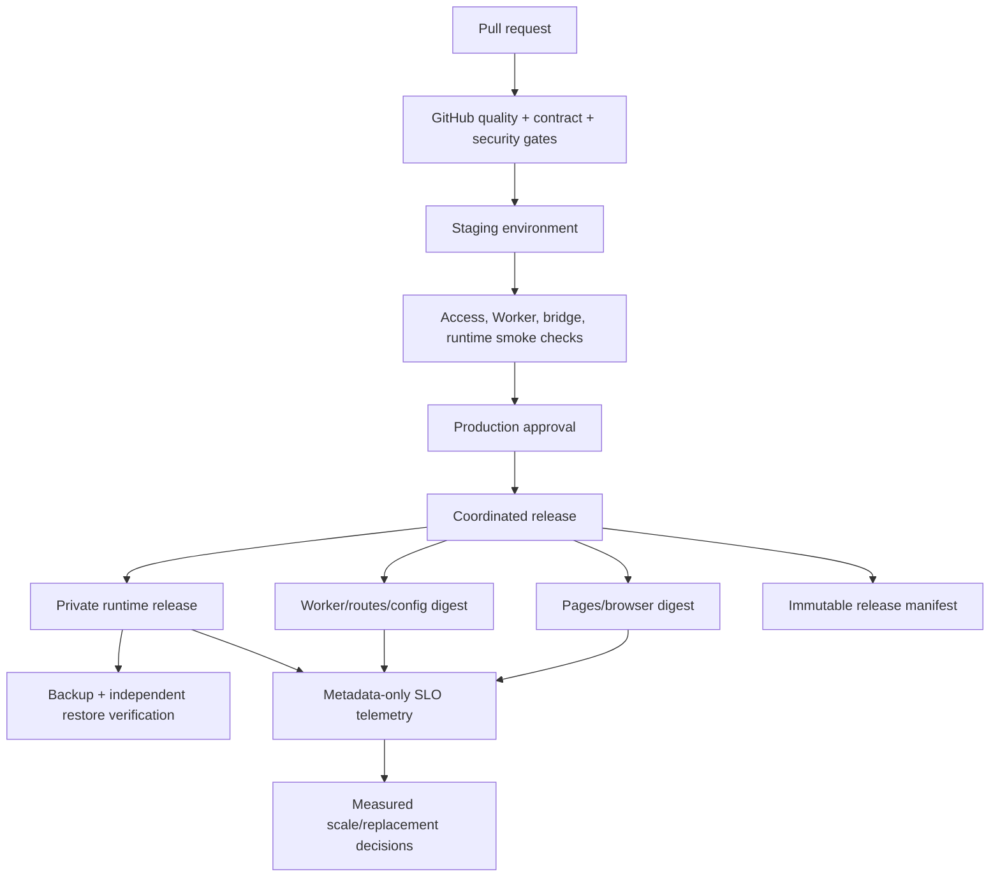

# Architecture and technology-stack assessment

**Date:** July 29, 2026
**Decision:** Keep the OpenAI, GitHub, and Cloudflare foundation. Add a small
deployment and operations control plane; do not replace the Python runtime,
SQLite, Flask, GitHub Actions, or the Cloudflare Worker yet.

## Executive recommendation

PJ's components are well matched to a private, single-owner assistant. OpenAI
provides the model and media plane, the Python process owns governed execution
and private data, Cloudflare provides the public trust boundary, and GitHub
provides source control and quality gates. The most important weakness is not a
poor technology choice: it is that four independently deployed surfaces can
drift without an automated release proving that they belong together.

The next investment should therefore be **additive**:

1. make GitHub Actions the release coordinator for the browser, Worker,
   configuration assertions, and private-runtime version;
2. introduce release manifests, staging smoke tests, rollback metadata, and
   restore drills;
3. add privacy-preserving service-level telemetry and provider evaluations;
4. introduce SQLite schema migrations before the data model changes again;
5. continue decomposing the largest Python and browser modules and expanding
   static typing.

A platform replacement would consume substantial effort while leaving the
actual failure mode—deployment drift—untouched. Reconsider managed compute and
state only when concurrency, availability, or team-size thresholds described
below are reached.

## What exists today

### OpenAI / GPT layer

- `ResponsesOrchestrator` is behind a `ResponsesProvider` protocol rather than
  being coupled throughout the application to an SDK. The production adapter
  is isolated under `ops/shared/providers`.
- Responses turns support hosted tools, remote MCP, local function calls,
  explicit approvals, artifact verification, and bounded recursion.
- Realtime media goes directly between the browser and OpenAI after signaling.
  This is a good latency and bandwidth boundary: PJ's edge and private runtime
  remain in the control/tool path instead of becoming an audio relay.
- Different state models are intentional: terminal continuation uses a local
  response ID, while browser Full Power turns use durable leases,
  checkpoints, approvals, and exact-once execution records in SQLite.

### GitHub layer

- The repository runs Python 3.11 linting, changed-file formatting checks,
  mypy, unit tests, dependency audits, Worker lint/tests, npm audit, and a
  non-secret Wrangler validation in GitHub Actions.
- Dependabot covers both pip and npm. The repository documents administrator
  checks for dependency graph, secret scanning, push protection, and
  Dependabot security updates.
- GitHub currently validates artifacts but does not act as the end-to-end
  release authority. Pages, Worker routes/configuration, WAF behavior, and the
  private runtime can consequently represent different commits.

### Cloudflare layer

- Cloudflare Access authenticates the owner, and the Worker independently
  validates the Access JWT, audience, origin, protocol version, and owner
  allowlist.
- The Worker is appropriately thin: it handles identity, signaling, contract
  reconciliation, bounded proxying, and header sanitation, but does not
  duplicate Python tools or durable application state.
- A Tunnel plus a separate bridge token protects the loopback Flask runtime.
  The browser never receives that credential.
- Only health and preflight are public. The unsigned legacy webhook is
  deliberately absent from the deployment manifest.

### Data and application layer

- Python 3.11 and Flask are adequate for the present one-process, single-owner
  workload. The runtime already uses clear provider and tool boundaries; an
  asynchronous framework would not by itself remove the local-state and
  single-instance constraints.
- SQLite and filesystem artifacts optimize for privacy, inspectability, and
  low operating cost. Durable turn leases and execution records address the
  highest-risk local concurrency cases.
- The cost of this simplicity is explicit: there is no migration framework,
  cross-instance coordination, managed failover, or independently verified
  disaster recovery.

## Decision by technology

| Layer | Decision now | Why | Revisit when |
| --- | --- | --- | --- |
| OpenAI Responses API | **Keep** | It is the richer orchestration path and is already hidden behind a provider interface. | Required capabilities cannot be expressed through the interface, or measured quality/cost targets repeatedly fail. |
| OpenAI Realtime API + WebRTC | **Keep** | Direct browser media minimizes PJ latency and avoids operating an audio relay. | A hard product requirement needs server-side media custody, recording, or a non-WebRTC channel. |
| Single production model configuration | **Add evaluation-based routing, not another provider yet** | Premature multi-provider support multiplies tool, approval, streaming, and safety contracts. | Offline evaluations show a second model/provider materially improves a named workload enough to pay that complexity. |
| Python 3.11 runtime | **Keep** | It owns local integrations and matches the existing test/deployment environment. | Python becomes a measured throughput bottleneck rather than an assumed one. |
| Flask | **Keep for now** | Replacing it does not solve deployment drift or state coordination. Streaming and threaded gunicorn already serve the current owner workload. | Sustained concurrent sessions require an async server, or route schemas need generated client contracts strongly enough to justify migration. |
| SQLite + filesystem | **Keep; add migrations and restore validation** | Correct fit for private, local-first, single-instance state. | More than one writer process is required, remote high availability becomes an SLO, or lock/latency measurements breach budgets. |
| Cloudflare Pages/Worker/Access/Tunnel | **Keep** | Strong separation of static delivery, edge authentication, signaling/proxy logic, and private execution. | The product becomes multi-tenant and needs regional durable coordination, or the private host no longer meets availability objectives. |
| GitHub Actions | **Keep; promote to release control plane** | Existing CI is broad and close to the code. The missing capability is coordinated deployment, not another CI vendor. | Compliance or scale requires an external deployment controller that GitHub environments cannot satisfy. |
| MCP connectors | **Keep optional and fail-closed** | They expand capability without moving local tool ownership. | A connector cannot meet approval, data-boundary, availability, or audit requirements. |

## Additions in priority order

### P0 — One reproducible release, not four manual deployments

Create a release workflow that produces an immutable manifest containing at
least:

- Git commit SHA and release identifier;
- browser asset/module version and content digest;
- Worker script digest and Wrangler route/config digest;
- Python runtime commit and protocol/tool-contract digests;
- expected bridge, Access, WAF, and canonical-domain assertions;
- database backup identifier, deployment timestamps, and rollback target.

Use separate GitHub `staging` and `production` environments, least-privilege
deployment credentials, required reviewers for production, and concurrency
serialization. The workflow should deploy or verify each surface, run smoke
tests through Access and the private bridge, then record the manifest. A
failure must stop promotion and preserve the last known-good manifest. The
private Mac can pull a signed/tagged release or run a narrowly scoped local
deployment runner; it should report its effective commit and contract hash so
the workflow can verify rather than assume success.

Extend `scripts/verify_cloudflare_sync.sh` rather than creating a parallel
source of route truth. Assert Pages/custom-domain state, Worker routes,
required variables (names only), WAF skip paths, Access application coverage,
Tunnel health, and the runtime `/health` release identity. Never print secret
values into Actions logs.

**Outcome:** the known drift risk is directly reduced, rollbacks become
deterministic, and every deployed component maps to one reviewed commit.

### P0 — Prove recovery of local state

The existing backup script is necessary but a backup is not evidence of
recoverability. Add an operator-safe restore verifier that copies a backup to
a temporary directory, runs SQLite integrity checks, validates referenced
artifact hashes, and reports counts and metadata only. Schedule it separately
from backup creation and retain a documented last-success timestamp.

Introduce a small, monotonic migration table and transactional migration
runner before the next schema change. Migrations must remain backward
compatible across one release boundary so runtime rollback is possible.
Document recovery-point and recovery-time objectives; without them, “local
first” silently means “single point of failure.”

### P1 — Add telemetry with privacy budgets

Preserve the metadata-only logging invariant. Build operational metrics from
the fields PJ already permits:

- request count, status, and duration by route class;
- provider latency/error class, model identifier, and token/cost totals;
- tool name, approval decision, duration, timeout, and success—never arguments
  or results;
- Realtime setup success, signaling fallback, disconnect reason, and session
  duration;
- schema reconciliation status and deployed release identity;
- backup/restore verification age.

Define a small initial SLO set: successful authenticated API requests,
Realtime session establishment, Full Power turn completion, and restore
verification freshness. Correlate browser → Worker → Flask → provider using
the existing request ID. Keep Cloudflare and provider log retention bounded,
sampled, and documented.

### P1 — Add model and prompt evaluations before model routing

Create a versioned, secret-free evaluation suite covering representative PJ
tasks: correct tool selection, refusal/approval behavior, structured output,
citation presence, artifact validity, latency, and token cost. Provider calls
remain mocked in the ordinary unit suite; live evaluations are an explicit,
budgeted operator workflow and never a required PR check.

Use these results to approve model or prompt changes. Add a routing policy only
after the evaluations demonstrate stable workload classes (for example,
low-latency conversation versus complex tool orchestration). Keep the
`ResponsesProvider` contract as the seam. Do not add a generic multi-provider
abstraction until a concrete second adapter has contract tests for streaming,
tools, approvals, continuation, and errors.

### P1 — Reduce change risk inside the monolith

Continue modularizing rather than replacing the runtime. The highest-value
targets are the oversized skills service, document service, realtime server,
and browser client. Extract validation, repositories, route handlers, and
provider orchestration behind compatibility facades. Expand mypy first at
untrusted boundaries: upload payloads, provider event parsing, Worker bridge
payloads, and persisted records.

Add contract fixtures shared by Python and Worker tests for protocol version,
tool schema hashes, approval responses, errors, and SSE events. This gives PJ
many benefits of generated contracts without immediately introducing a new
schema platform.

### P2 — Supply-chain and repository hardening

- Protect the default branch with the quality gate, review requirements, and
  resolved-conversation enforcement.
- Pin third-party GitHub Actions to reviewed commit SHAs and use an automated
  update process for those pins.
- Add dependency review for pull requests and CodeQL if repository
  availability/licensing supports them.
- Remove the duplicated runtime dependency-audit step in the Python quality
  job to shorten CI without reducing coverage.
- Generate a release SBOM and provenance/attestation for deployed browser,
  Worker, and Python dependency sets. Treat these as release metadata, not as
  a substitute for scanning or review.

## Replacements explicitly not recommended now

### Do not move tools into the Worker

That would weaken the local-data boundary, duplicate Python capabilities in
JavaScript, complicate approvals, and introduce two authoritative execution
planes. Keep the Worker stateless and policy-focused.

### Do not move SQLite to D1, Durable Objects, or hosted Postgres yet

Moving only chat state would split transactions from local artifacts and
tools; moving everything would change the product's privacy and offline
properties. First add migrations, restore tests, and performance measurements.
If multi-instance service becomes necessary, choose one authoritative managed
store and design artifact storage, encryption, retention, and data migration
together—not piecemeal.

### Do not rewrite Flask as FastAPI solely for modernity

Typed HTTP schemas and async I/O can be valuable, but PJ's constraints are
state ownership, deployment coordination, and large mixed-responsibility
modules. Extracting domain boundaries and typed payloads now makes a later
framework migration smaller and evidence-based.

### Do not replace GitHub Actions or Cloudflare

Both products already cover the required source/CI and edge/security roles.
PJ is underusing their release coordination and verification capabilities.
Changing vendors adds migration risk without addressing the missing release
manifest and restore proof.

### Do not add Kubernetes or microservices

There is one owner, one private execution host, and tightly coupled local
state. Containers may eventually improve reproducibility, but orchestration
would add more failure modes than it removes. A macOS host remains necessary
for current `textutil` behavior unless that feature is replaced or isolated.

## Quantitative triggers for reconsideration

Use measurements rather than roadmap aspiration to trigger replacement work.
Suggested initial thresholds are:

| Trigger | Architectural response to evaluate |
| --- | --- |
| More than one active owner or a need for tenant isolation | Tenant-aware identity, authorization, storage partitioning, quotas, and a formal threat-model review. |
| More than one Python instance must accept writes | Managed transactional database, distributed/idempotent job execution, object storage, and a migration plan as one design. |
| Private-host availability misses the agreed SLO for two reporting periods | Redundant runtime or managed compute, after classifying macOS-only capabilities. |
| SQLite lock waits or p95 turn persistence exceed the budget for two releases | Profile queries and transaction scope, then evaluate a server database if tuning is insufficient. |
| Worker CPU/subrequest/size limits block a required flow | Move that flow to the private runtime or a purpose-built service; do not expand edge responsibility by default. |
| Live evaluation quality or unit cost misses its target twice after prompt/model tuning | Trial a second model or provider behind the existing provider contract. |
| Two or more engineers regularly change the same large module | Accelerate module extraction and explicit ownership; still avoid network service boundaries until independent scaling is needed. |

Threshold values for latency, error rate, recovery time, and cost should be set
from two to four weeks of baseline telemetry rather than invented in advance.

## Target architecture after the additions

This target intentionally preserves the product boundary: Cloudflare owns
edge trust, OpenAI owns model/media services, Python owns governed execution,
and local storage owns private durable state. GitHub becomes the evidence and
coordination layer tying those components to a single release.

## 30/60/90-day sequence

### Days 0–30

1. Define release ID and manifest schema.
2. Make every health response expose non-secret commit/protocol/contract
   metadata.
3. Add staging and production GitHub environments and serialize deployments.
4. Extend Cloudflare drift checks and document an automatic rollback.
5. Establish backup/restore objectives and implement temporary restore
   verification.

### Days 31–60

1. Add a backwards-compatible migration runner.
2. Establish metadata-only dashboards and initial SLOs.
3. Add cross-language protocol fixtures and staging smoke tests.
4. Create the offline model/prompt evaluation dataset and scoring receipt.
5. Pin Actions and add dependency-review/static-analysis controls where
   available.

### Days 61–90

1. Use baseline telemetry to set explicit latency, reliability, recovery, and
   cost budgets.
2. Split the first large service along repository/validation/orchestration
   boundaries and widen mypy coverage.
3. Run and document a rollback plus state-restore game day.
4. Revisit managed state, async HTTP, or a second model only if a trigger has
   actually fired.

## Assessment limitations

This is a repository architecture assessment, not a live Cloudflare, GitHub,
or OpenAI account audit. It treats the live-deployment observations recorded
in the July 28 product/technology report as historical evidence and does not
assume they remain true. No credentials or provider accounts were available,
and network access to official provider documentation was unavailable during
this review. Account settings, quotas, current pricing, deployed digests, WAF
rules, Access policies, Tunnel health, and backup contents must therefore be
verified by the proposed release workflow or an authorized operator.
