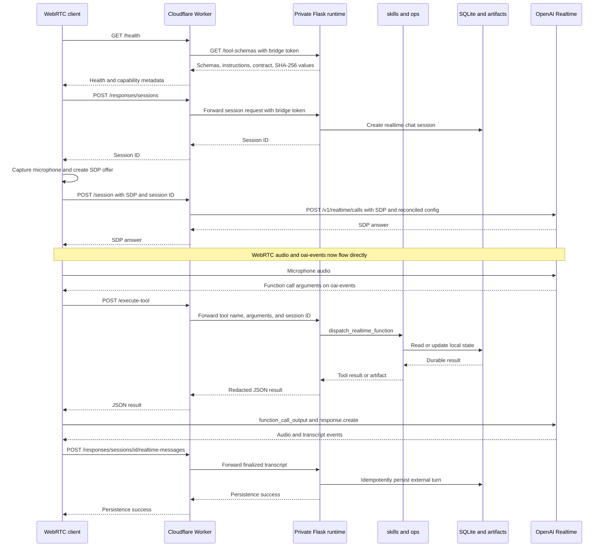
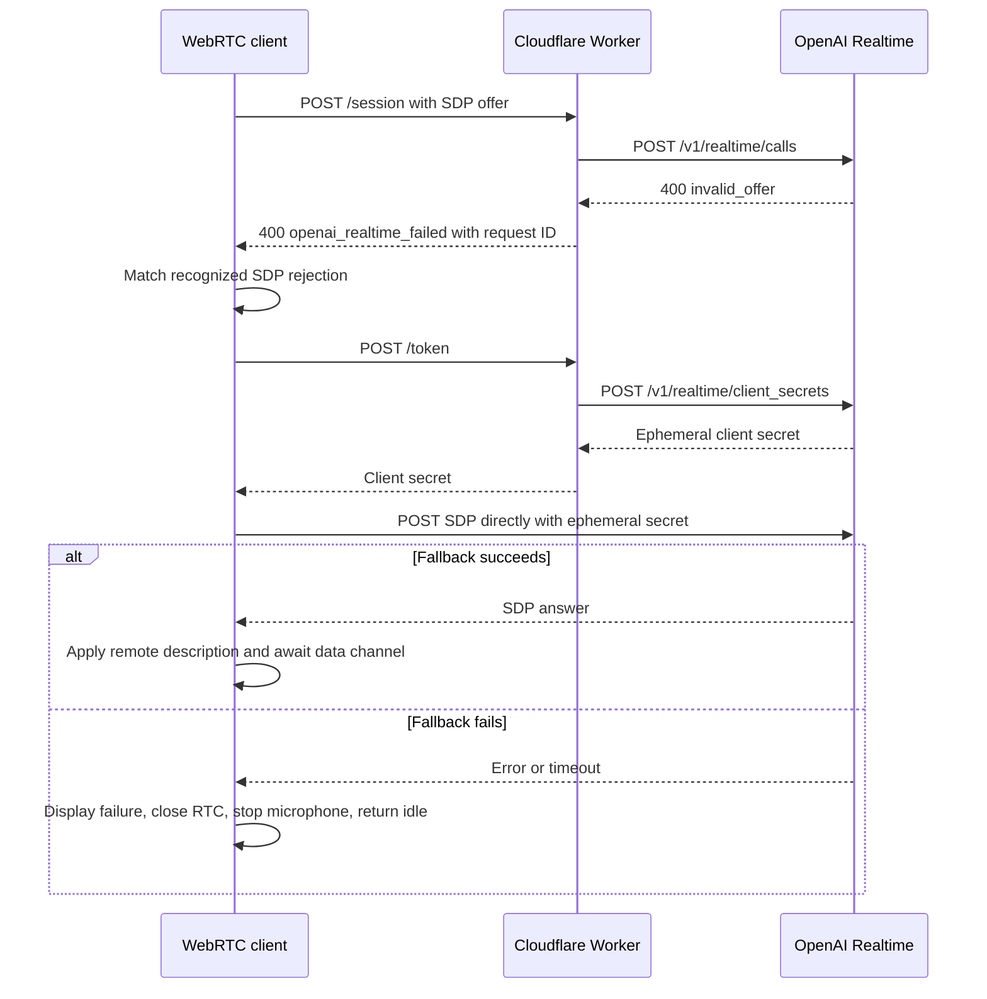

# End-to-end architecture

PJ has one Python runtime with several entry surfaces, an optional Cloudflare
Worker in front of browser API traffic, and a static browser client that uses
both HTTP and WebRTC. The Worker is an authenticated proxy and signaling
service; it does not contain the local tools or durable application state.

## System boundaries

| Boundary | Responsibilities | Key entry points |
| --- | --- | --- |
| Python assistant runtime | Loads configuration, orchestrates Responses API turns, dispatches governed local tools, exposes the private browser API, and owns local persistence. | [`pj.py`](../pj.py), [`ops/realtime/orchestration.py`](../ops/realtime/orchestration.py), [`ops/realtime/server.py`](../ops/realtime/server.py) |
| Compatibility entry points | Preserve existing imports while the implementations live under `ops/`. | [`responses_runtime.py`](../responses_runtime.py), [`realtime_server.py`](../realtime_server.py), and the top-level `*ops.py` modules |
| Cloudflare Worker | Validates origin, PJ protocol version, Cloudflare Access identity, audience, and owner email; creates OpenAI Realtime sessions; reconciles tool schemas; and proxies tool and Full Power requests to Python. | [`pj_realtime_backend_worker.js`](../pj_realtime_backend_worker.js), [`wrangler.toml.example`](../wrangler.toml.example) |
| Browser client | Owns microphone permission, `RTCPeerConnection`, the `oai-events` data channel, mode selection, transcript rendering, tool-call relay, and SSE consumption. | [`webrtc_client.html`](../webrtc_client.html), [`assets/pj_web_utils.js`](../assets/pj_web_utils.js) |
| OpenAI | Terminates browser WebRTC media/data, runs Realtime and Responses models, and executes enabled hosted tools such as Web Search, File Search, and remote MCP. | Realtime `/v1/realtime/calls` and `/client_secrets`; Responses API through the Python SDK |
| Local operations and state | Implements function tools and records chats, approvals, exact-once tool execution state, artifacts, tasks, and other durable records. | [`skills.py`](../skills.py), `ops/*/service.py`, [`chatlog.py`](../chatlog.py), `pj_data.sqlite3`, and `documents/exports/` |

When run directly, the local Flask process binds to `127.0.0.1:3001` by
default and enables its built-in client only for a loopback bind. `GET /` also
requires a loopback request and creates a same-origin, HTTP-only owner session
used by protected local routes. In an edge deployment, the Flask process
remains private and accepts a matching
`PJ_TOOL_BRIDGE_TOKEN`; the public Worker independently enforces Cloudflare
Access. The browser never receives that bridge credential, and the Worker
replaces inbound credentials with an allowlisted set of bridge headers.

The browser's WebRTC media and `oai-events` channel connect directly to OpenAI
after signaling. Neither the Worker nor Flask remains in the media path.
Tool execution, transcript persistence, Full Power turns, and artifacts
continue to travel over HTTP through the selected API base.

## Python runtime

### Responses and terminal surfaces

The `./pj` launcher loads `~/.env` and runs `pj.py`. `pj.py` handles terminal
chat, structured JSON output, image subcommands, and the handoff to terminal
voice. Responses orchestration is implemented by `ResponsesOrchestrator` in
`ops/realtime/orchestration.py`; `responses_runtime.py` is only a compatibility
alias.

For each Responses turn, the orchestrator:

1. Builds the provider request from the configured model, instructions,
   reasoning effort, hosted tools, remote MCP servers, and local function
   schemas.
2. Streams provider text and tool lifecycle events.
3. Dispatches ordinary local function calls through `skills.dispatch`, then
   submits `function_call_output` to the preceding response.
4. Pauses for explicit owner confirmation when `tool_policy.json` marks a local
   function for approval, or when OpenAI returns an MCP approval request.
5. Verifies generated artifacts, bounds tool recursion, and emits a final
   completion with citations, sources, and the provider response ID.

The terminal stores its continuation ID in `state.json`. Browser Full Power
sessions instead use `chatlog.py`: the SQLite session row owns
`last_response_id`, turn leases, pending approvals, provider checkpoints, and
durable tool-execution records. This lets the server reject concurrent turns
and avoid replaying an approved side effect when its outcome is unknown.

`ops/shared/interfaces.py` defines the provider and dispatcher boundaries.
`OpenAIResponsesProvider` is the production Responses adapter. Domain
implementations live under `ops/`; top-level modules such as `docops.py` and
`codeops.py` alias those implementations for compatibility.

### Private browser API

`realtime_server.py` aliases and runs `ops/realtime/server.py`. Important
routes are:

- `POST /session` and `POST /token`: create a Realtime call or mint the
  ephemeral secret used by the browser's fallback signaling path.
- `GET /tool-schemas`: publish the Realtime-safe function schemas,
  authoritative instructions, contract metadata, and SHA-256 values consumed
  by the Worker.
- `POST /execute-tool`: dispatch one Realtime-safe local function and link any
  resulting artifact to the supplied chat session.
- `/responses/*`: create, list, search, and resume durable sessions; stream
  turns and approval continuations as server-sent events; persist Realtime
  transcripts; and download integrity-checked artifacts.
- `POST /webhook`: accept an inbound OpenAI SIP call. This route exists in
  Python but is not deployed by the checked-in Worker manifest.

Every PJ JSON message and SSE event carries protocol version `1`. SDP uses the
`x-pj-protocol-version` header because its body is not JSON. See
[Realtime protocol compatibility](realtime-protocol.md) for the wire contract
and `426` behavior.

## Worker and browser runtime

The Worker exposes only `GET /health` and CORS preflight without an Access
identity. All other current and future API routes fail closed behind
Cloudflare Access. It verifies the Access JWT against the team certificate,
issuer, configured audience, expiration, and `PJ_OWNER_EMAILS` allowlist before
routing a privileged request.

The Worker's direct responsibilities differ by route:

- `/session` and `/token` resolve the current Realtime tools, normally by
  fetching and validating the private runtime's manifest, then call OpenAI
  with those tools and instructions. Reconciled schemas are cached for a
  bounded period. A contract mismatch or SHA-256 mismatch fails reconciliation
  and produces a tool-less Realtime session rather than trusting stale or
  altered schemas.
- `/execute-tool` forwards an allowlisted JSON request to
  `PJ_TOOL_BRIDGE_URL`. The Worker cannot execute a Python tool itself.
- `/responses/*` streams the private runtime response through without
  buffering it into JSON. The proxy allowlists route shapes, caps request
  bodies, prevents bridge loops, and sanitizes artifact response headers.
- `/health` reports schema reconciliation and bridge readiness as well as
  direct Realtime availability.

`webrtc_client.html` selects its API base from the current host and persists
manual changes in `localStorage`. It supports three modes:

- **Fast Voice** uses server VAD with automatic response creation.
- **Full Power Voice** disables automatic response creation. When transcription
  completes, the client calls `/responses/prompt-perfect`, preserves the
  original transcript and refinement metadata, replaces the Realtime
  conversation item with the refined text, and explicitly requests a response.
- **Full Power Text** sends a durable turn to `/responses/sessions/<id>/turns`
  and renders SSE text, tools, approvals, citations, sources, and artifacts.

Realtime function calls arrive from OpenAI over `oai-events`. The client calls
`/execute-tool`, sends the returned JSON to OpenAI as
`function_call_output`, and requests the continuation. Approval-sensitive and
long-running tools are excluded from Realtime schemas; the
`delegate_advanced_task` function can run a bounded Responses turn, but directs
approval-requiring work to Full Power mode.

## Tool and MCP integration

`skills.py` is the local function registry. It combines its core schemas with
the operation families under `ops/`, looks up policy through
[`tool_policy.json`](../tool_policy.json), strips any untrusted `_approved`
argument, and requires trusted server-side approval for governed tools.
Realtime receives only the filtered schema set in
`ops/realtime/config.py`; Full Power receives the complete local set.

`build_tools` adds enabled OpenAI hosted tools and the vector stores from
[`config.json`](../config.json). It also translates enabled entries from
[`mcp_servers.json`](../mcp_servers.json) into Responses API MCP tools.
Environment references in MCP headers are expanded at runtime; an unresolved
reference prevents that connector from being sent. MCP calls execute on the
provider side, while approval requests return through the same durable approval
flow as local functions. Checked-in `******` values are placeholders, not
credentials.

[`huggingface_mcp_server.py`](../huggingface_mcp_server.py) is a separate,
dependency-free MCP server over stdio. It is not automatically registered by
the HTTP-oriented `mcp_servers.json` loader; an MCP client must launch it using
the configuration in the
[Hugging Face MCP server guide](huggingface-mcp-server.md). Public discovery
is read-only and bounded; inference additionally reads `HF_TOKEN` from the
process environment.

## Runtime sequence: Fast Voice with a local tool

This edge-deployed happy path includes schema reconciliation, signaling, the
direct WebRTC channel, local tool execution, and durable transcript storage.
The Access assertion is required on each privileged browser-to-Worker request
but is omitted from repeated labels below.

## Failure sequence: SDP rejection and ephemeral recovery

The browser uses ephemeral signaling only for a server error or a recognized
SDP parsing rejection. Other `4xx` responses fail immediately. If recovery
also fails, `startSession` reports the error, closes the data channel and peer
connection, stops microphone tracks, and returns the UI to idle.

For a `400` response that identifies the configured Realtime model as
unsupported, the Worker first retries the same signaling operation with
`REALTIME_MODEL_FALLBACK`. Transport failures become bounded `502` errors;
timeouts and provider failures retain a request ID for correlation.

## Configuration relationships

[`runtime_config.py`](../runtime_config.py) is the Python configuration
authority. It selects `PJ_PROFILE=dev|staging|prod`, loads the checked-in
sources, applies an optional profile overlay, then applies shorthand,
`PJ_CONFIG_OVERRIDES`, and `PJ_CONFIG__SECTION__FIELD` environment overrides.
It validates required profile secrets before returning these sections:

| Section | Primary source | Consumers |
| --- | --- | --- |
| `assistant` | `config.json` and `pj_instructions.txt` | Terminal and browser Responses orchestration |
| `mcp_servers` | `mcp_servers.json` | Responses tool construction and capability reporting |
| `tool_policy` | `tool_policy.json` | Local dispatch and approval decisions |
| `realtime` | Defaults plus `PJ_REALTIME_MODEL` and `PJ_REALTIME_VOICE` | Python browser and terminal voice session configuration |
| `worker` | `wrangler.toml`, falling back to `wrangler.toml.example` | Python-side validation and inspection of Worker settings |

The deployed Worker reads Cloudflare bindings directly; loading its manifest
in Python does not configure a deployment. `OPENAI_API_KEY`,
`PJ_OWNER_EMAILS`, and `PJ_TOOL_BRIDGE_TOKEN` are Worker secrets.
`PJ_ALLOWED_ORIGINS`, Access settings, and bridge URLs are Worker variables.
The Worker's optional model names are `REALTIME_MODEL` and
`REALTIME_MODEL_FALLBACK`, distinct from Python's `PJ_REALTIME_MODEL`.

The Python, Worker, and browser must agree on `CONTRACT_VERSION` for schema
reconciliation and on `PROTOCOL_VERSION` for wire compatibility. The browser
rejects missing or incompatible protocol markers instead of continuing with an
unknown server.

See the repository [setup and configuration guide](../README.md#prerequisites-and-setup),
[local browser instructions](../README.md#local-browser-and-private-runtime),
and [Cloudflare Worker deployment guide](../README.md#cloudflare-worker) before
changing these relationships.

## Persistence, errors, and troubleshooting

Local state is intentionally single-host:

- `pj_data.sqlite3` stores chat sessions/messages, approvals, execution
  reservations, local tool records, and artifact links.
- `state.json` stores terminal Responses continuation state.
- `documents/exports/` contains exported and immutable artifact files.
- OpenAI retains provider-side response continuity identified by
  `last_response_id`; the repository provides no shared multi-instance state.

The browser supplies `x-pj-client-request-id`; the Worker and Flask runtime
reuse valid IDs and return `x-request-id`. Python logs are structured JSON and
redact secret-bearing fields and values. Error bodies use a stable code,
bounded detail, and the same request ID. Full Power stream failures are sent as
SSE `error` events, and the server always releases the session turn lease.

For operational diagnosis:

1. Check `/health`. On the Worker, inspect `full_tooling_ready`,
   `full_power_bridge_configured`, schema source, hashes, and reconciliation
   timestamps. On Flask, inspect bridge authorization and tool count.
2. Use the returned request ID to correlate Worker and Python JSON logs.
3. Treat `edge_tools_unavailable`, `bridge_auth_not_configured`, and
   `responses_bridge_not_configured` as deployment/configuration errors, not
   model errors.
4. Treat `unsupported_protocol_version` as a client/server release mismatch and
   follow the [Realtime protocol compatibility](realtime-protocol.md) rules.
5. Review the repository's [known gaps and operational limits](../README.md#known-gaps-and-operational-limits)
   for private-runtime, state, frontend deployment, SIP, and integration
   constraints.
