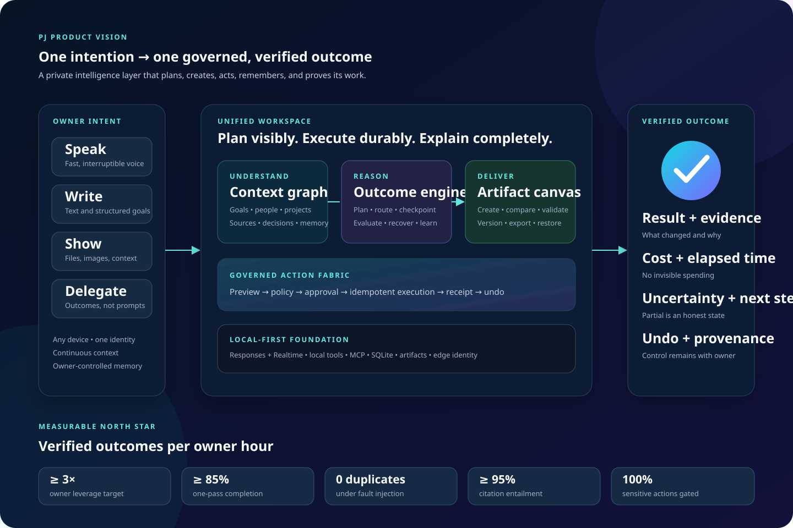

# PJ product vision

## The governed personal intelligence layer

PJ's best possible form is not another chat window. It is a **private, proactive
operating layer for one person's work**: a single place to think, speak, create,
decide, and safely complete actions across devices. It combines the speed of a
voice assistant, the depth of an expert workbench, and the control plane of a
well-run production system.

The diagram is intentionally layered. Every experience enters one continuous
context, every request is planned against the same capability graph, every
side effect crosses the same policy boundary, and every durable outcome has a
receipt. The product should feel simple because the complexity is made visible
only when the owner needs control.

## Product promise

> Tell PJ the outcome once. PJ builds the context, proposes the plan, asks only
> for consequential decisions, completes approved work, and returns a verified
> result with provenance.

The north-star measure is **verified outcomes per owner hour**. Conversation
volume and tool-call count are diagnostics, not success metrics.

## The ideal experience

### 1. One continuous workspace

- A responsive web application joins text, voice, files, camera input,
  artifacts, approvals, and history in one timeline.
- A universal command bar starts a conversation, retrieves an existing
  project, or acts on a selected artifact without requiring mode selection.
- Voice can begin on a phone and continue as a structured desktop workspace;
  the transcript, sources, approvals, and deliverables remain synchronized.
- Each conversation can graduate into a **workspace** with a goal, plan,
  sources, decisions, tasks, artifacts, budget, and activity trail.

### 2. An outcome engine, not a prompt box

- PJ converts intent into a visible, editable execution plan and identifies
  assumptions before spending money or changing external state.
- A capability router selects local tools, hosted tools, MCP connectors, or a
  bounded specialist agent according to cost, latency, risk, and confidence.
- Long-running work survives disconnects, checkpoints after each safe step,
  and resumes without replaying side effects.
- The final answer is an **outcome card**: result, evidence, changes made,
  remaining uncertainty, cost, elapsed time, and undo or follow-up actions.

### 3. Memory the owner can inspect

- A personal knowledge graph links people, projects, commitments, decisions,
  sources, and artifacts while preserving the source of every remembered fact.
- Memory is proposed rather than silently inferred. The owner can accept,
  correct, expire, pin, export, or delete it.
- Retrieval combines conversation recency, semantic relevance, project scope,
  and source authority. PJ explains which memories influenced an answer.
- A daily brief surfaces commitments at risk, decisions needed, meaningful
  changes, and suggested next actions without generating notification noise.

### 4. Calm, risk-proportionate control

- A preview shows the exact effect of consequential actions. The approval card
  states **what**, **where**, **who is affected**, **cost**, and **reversibility**.
- Low-risk, reversible work can run under an owner-defined policy; destructive,
  public, credentialed, or paid work always reaches the appropriate gate.
- Every tool execution receives an idempotency key and a metadata-only receipt.
  Artifacts include integrity, lineage, and source information.
- A privacy center exposes stored data, connector access, budgets, retention,
  and an immediate kill switch for background execution.

### 5. Deliverables that are ready to use

- Documents, presentations, spreadsheets, images, and code share a coherent
  artifact canvas with preview, comments, version comparison, and export.
- PJ validates outputs against the request: links resolve, calculations
  reconcile, slide overflow is absent, citations support claims, and code
  passes the declared checks.
- The owner can branch an artifact, request a focused revision, or restore a
  prior version without restarting the conversation.

## Information architecture and interaction design

The default screen uses a three-panel layout while collapsing cleanly to a
single timeline on mobile:

| Region | Purpose | Key elements |
| --- | --- | --- |
| **Left: Spaces** | Durable orientation | Inbox, Today, projects, saved views, search, connector health |
| **Center: Work** | Intent and collaboration | Unified timeline, voice/text composer, live plan, tool activity, outcome cards |
| **Right: Context** | Inspectability without clutter | Sources, memory, artifacts, approvals, budget, run details |

### Visual language

- **Calm precision:** deep navy surfaces, warm white content, electric cyan for
  active intelligence, violet for synthesis, and mint for verified outcomes.
- **Progressive disclosure:** ordinary conversation stays quiet; plans,
  provenance, and runtime details expand in place rather than opening a
  separate administrator interface.
- **Semantic status:** never rely on color alone. Every state combines a label,
  icon, and motion pattern: thinking, waiting, approval required, executing,
  verified, partially complete, or failed safely.
- **Evidence-first output:** sources and confidence sit beside the claim or
  artifact they support. Verification is visually distinct from generation.
- **Accessible by default:** keyboard-complete operation, visible focus,
  reduced-motion support, screen-reader announcements, 4.5:1 text contrast,
  captions, and text equivalents for voice interactions.

## Capability model

| Layer | Best-version capability | Existing foundation |
| --- | --- | --- |
| Experience | Unified responsive timeline across text, voice, files, approvals, and artifacts | Browser text/voice modes, terminal clients, uploads, saved conversations |
| Orchestration | Durable goal plans, resumable jobs, specialist routing, outcome verification | Responses orchestration, tool recursion bounds, provider interface, exact-once records |
| Knowledge | Owner-editable knowledge graph with scoped, provenance-aware retrieval | SQLite records, chat history, File Search, local documents, semantic memory |
| Creation | One versioned canvas for documents, decks, sheets, images, and code | Governed exports, artifact lineage, document/image/presentation/code tools |
| Action | Connector catalog with preview, policy, idempotency, rollback, and receipts | Local tools, MCP, approval policy, spend guard, bridge authentication |
| Operations | Observable job control, health, backup/restore, release promotion, and drift detection | Structured metadata logs, health endpoint, profiles, validation scripts, runbook |

## Quantifiable improvements

These are **product targets**, not claims about the current system. Baselines
must be measured with an opt-in, privacy-preserving evaluation harness before
reporting improvement percentages. Each target has a measurement rule so it
cannot be satisfied by a cosmetic change.

| Dimension | Target | Measurement |
| --- | ---: | --- |
| Time to useful response | p50 **< 1.5 s** text; voice acknowledgement **< 400 ms** | Client-observed time from submit/end-of-turn to first meaningful token/audio across a fixed task set |
| Outcome completion | **≥ 85%** without owner re-prompt; **≥ 95%** with one clarification | Blind scoring of representative, versioned end-to-end tasks against explicit acceptance criteria |
| Owner leverage | **≥ 3×** verified outcomes per active hour versus baseline | Completed outcomes passing acceptance checks divided by active owner time |
| Reliability | **99.9%** successful turn admission; **≥ 99%** safe job recovery | Synthetic checks plus forced disconnect/restart exercises, excluding provider-wide incidents separately |
| Side-effect safety | **0** duplicate side effects in fault-injection suite; **100%** sensitive actions gated | Idempotency/replay tests and policy-schema coverage in CI |
| Truthfulness | **≥ 95%** citation entailment; **< 2%** unsupported high-impact claims | Human-reviewed stratified sample with source-to-claim checks |
| Retrieval quality | Recall@10 **≥ 0.90** on owner-approved evaluation set | Frozen queries and relevance judgments, segmented by project and source type |
| Artifact quality | **≥ 90%** first-pass acceptance; **100%** automated integrity checks | Acceptance rubric plus format-specific validators before delivery |
| Accessibility | WCAG 2.2 AA; **100%** critical flows keyboard operable | Automated scans plus manual keyboard and screen-reader scripts |
| Cost control | **100%** paid runs budgeted; p95 estimate error **≤ 15%** | Estimated versus actual provider/tool cost per outcome |
| Operational recovery | RPO **≤ 24 h**, RTO **≤ 30 min** for local state | Quarterly restore drill from an isolated backup |
| Deployment integrity | **100%** promoted releases traced to one commit; drift detected **< 5 min** | Signed release manifest and scheduled edge/runtime parity check |

Guardrail metrics accompany the north star: approval comprehension, undo
success, high-impact error rate, privacy incidents, cost per verified outcome,
and daily-brief dismissal rate. Speed or autonomy must never improve by
weakening these guardrails.

## Delivery sequence

### Horizon 1 — Make the current product legible and measurable

1. Instrument privacy-safe latency, completion, failure, approval, and artifact
   verification events with no prompt or tool payload capture.
2. Introduce outcome cards and a unified activity model over the existing
   Full Power, Realtime, tool, and artifact lifecycle events.
3. Add automated end-to-end evaluation fixtures and publish a local scorecard.
4. Create one release manifest and parity check for client, Worker, runtime,
   configuration contract, and route policy.

### Horizon 2 — Turn conversations into durable work

1. Add workspaces, explicit goals, editable plans, and resumable background
   jobs while keeping SQLite/file changes backward compatible.
2. Build the context panel for sources, memories, artifacts, approvals, and
   execution receipts.
3. Add artifact comparison, targeted revision, validation, and restoration.
4. Ship inspectable memory proposals and project-scoped retrieval controls.

### Horizon 3 — Proactive, governed execution

1. Add owner-authored automation policies with simulation and conservative
   defaults; preserve hard gates for destructive, paid, or credentialed work.
2. Deliver a priority-ranked daily brief based on explicit commitments and
   verified changes.
3. Add connector health, action previews, rollback contracts where supported,
   and periodic access review.
4. Optimize routing for quality, latency, and cost only after the safety and
   outcome scorecards are stable.

## Non-goals and constraints

- PJ remains owner-controlled; it does not become a public multi-tenant
  assistant by accident.
- Proactivity never means silent consequential action. Autonomy is bounded by
  explicit policy, budget, reversibility, and auditability.
- Memory does not become covert surveillance. The owner controls capture,
  correction, retention, export, and deletion.
- The product does not hide uncertainty behind polished prose. Partial results
  and missing evidence are first-class states.
- Cloud scale is not an immediate goal. The local-first architecture should be
  made reliable, restorable, and observable before multi-instance complexity.

## Definition of the best version

PJ succeeds when the owner can move from an unstructured intention to a
verified, reusable outcome with less coordination overhead, while always
understanding what the system knows, what it plans to do, what it changed, what
it cost, and how to stop or reverse it.
