# Current application workflow diagrams

This document maps every current PJ feature described by the application and
its operation registries. The diagrams show user-visible workflows rather than
individual implementation helpers. A feature is **governed** when policy,
validation, approval, budget, or integrity checks can stop it before a side
effect occurs.

## Feature coverage

| Feature group | Included workflows |
| --- | --- |
| Entry surfaces | Terminal interactive and one-shot chat, structured JSON, terminal voice, browser Fast Voice, Full Power Voice, and Full Power Text |
| Conversation state | Streamed Responses turns, continuation, chat creation/list/search/resume, transcript persistence, citations, sources, and artifacts |
| Personal operations | Tasks, notes, semantic memory, contacts, calendar, reminders, email drafts, projects, commitments, opportunities, decisions, risks, daily briefs, and macOS Shortcuts |
| Governed tools | Local dispatch, realtime filtering, approvals, exact-once execution, timeouts, and artifact verification |
| Documents and uploads | Templates, draft/revise/finalize, immutable versions, upload screening, safe extraction, exports, downloads, and automatic vectorization |
| Presentations | Governed presentation specs, revision, native PPTX rendering, validation, and preview generation |
| Images and vision | Controlled SVG, registration, lookup, feedback, deletion, uploaded-image analysis, paid generation, and generated-image persistence |
| Code and delegation | CodeOps tasks, repository inspection/search/read, evidence, validation, guidance, completion, read-only Codex analysis, governed Codex delegation, and hosted shell artifacts |
| Skills and strategy | Pattern observation, generated-skill lifecycle and telemetry review, goal contracts, evidence bundles, timeline replay, and weekly reviews |
| Knowledge and research | Web Search, File Search, MCP connectors, deep research, vector-store ingestion/sync, n8n corpus governance, PJ knowledge MCP, and Hugging Face MCP |
| Utility and integration tools | Current time, capability snapshot, active browser tab, URL fetch and website health, generated-site deployment, and governed environment-file helpers |
| Browser edge | Loopback owner sessions, Cloudflare Access, schema reconciliation, signaling fallback, local-tool bridging, uploads, and health reporting |
| Configuration and operations | Typed profiles and overrides, fail-closed startup, structured redacted logging, request correlation, process mining, backup, deployment validation, and incident recovery |

## 1. Entry surface and mode selection

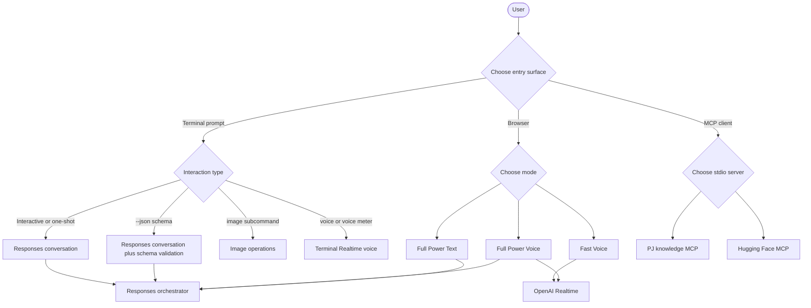

## 2. Responses conversation and durable history

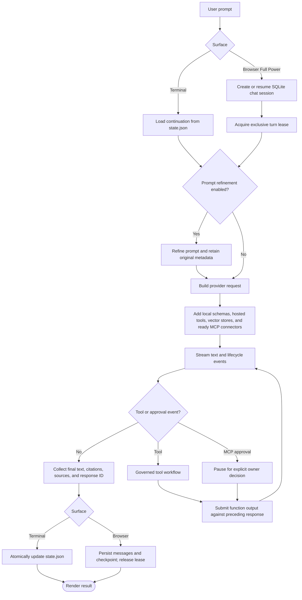

Browser history commands and APIs follow the same state model:

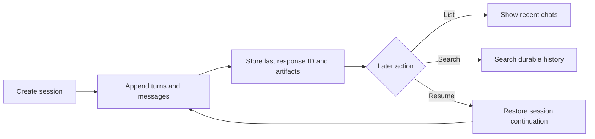

## 3. Governed local tool execution

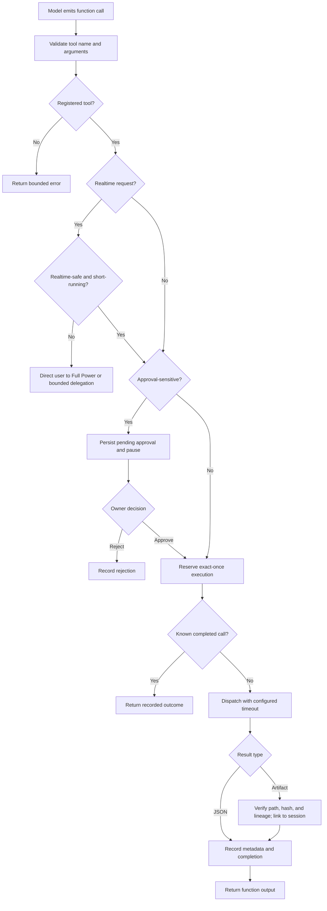

The assistant never trusts a model-supplied `_approved` argument. Approval is
server-side state, and Realtime schemas exclude approval-sensitive and
long-running tools.

## 4. Personal operations and executive workflow

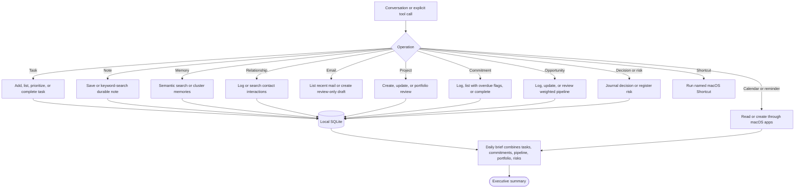

## 5. Upload, extraction, and download workflow

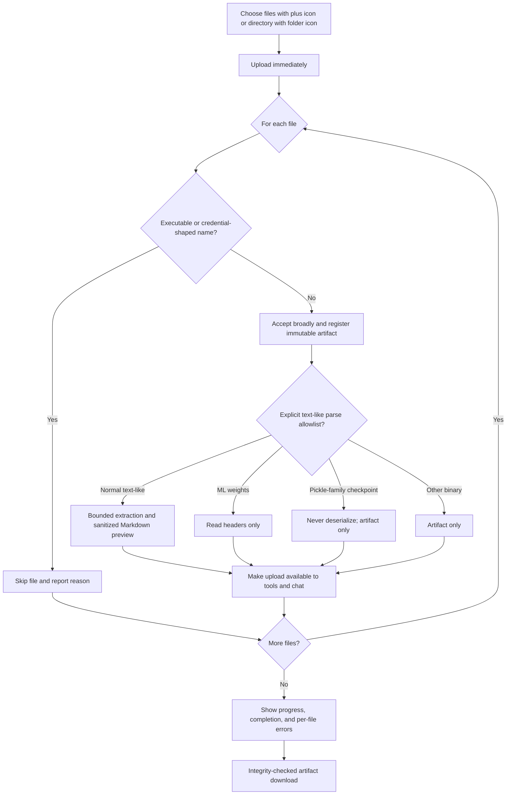

## 6. Governed document workflow

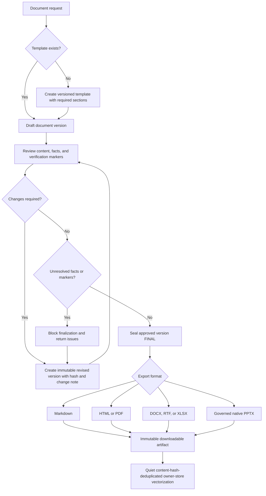

DOCX and RTF conversion depends on macOS `textutil`; PPTX export is allowed
only for a governed presentation document.

## 7. Presentation workflow

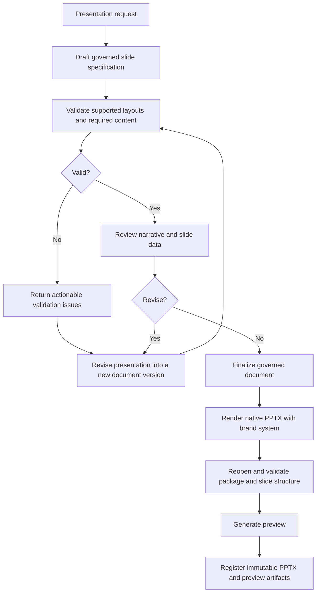

## 8. Image, asset, and vision workflow

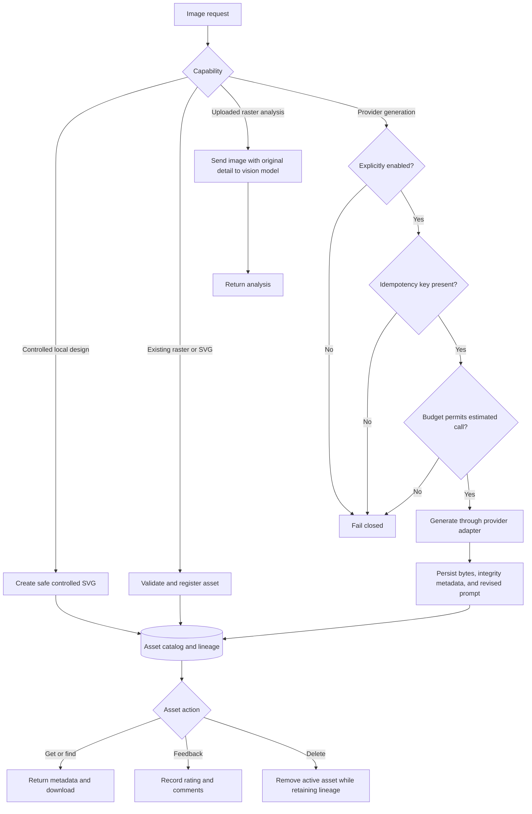

The current provider adapter supports generation. Binary edit and variation
requests return explicit unavailable errors rather than silently substituting
another operation.

## 9. CodeOps, Codex delegation, and hosted compute

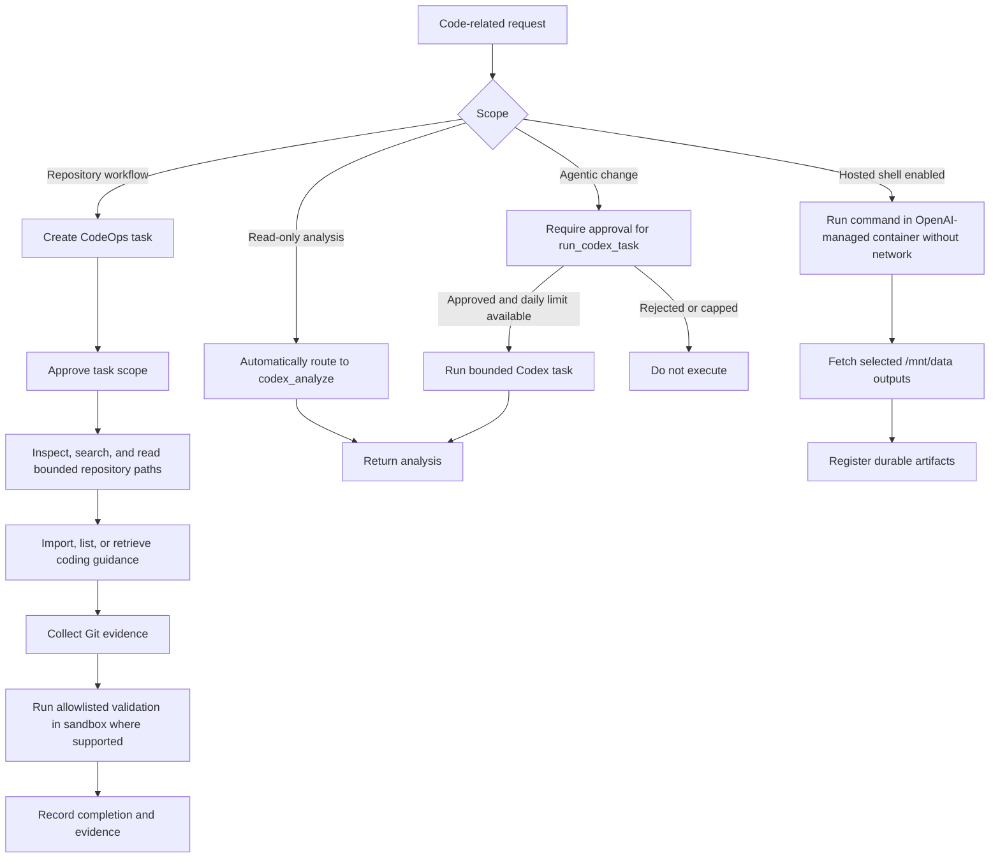

## 10. Skill lifecycle and strategic governance

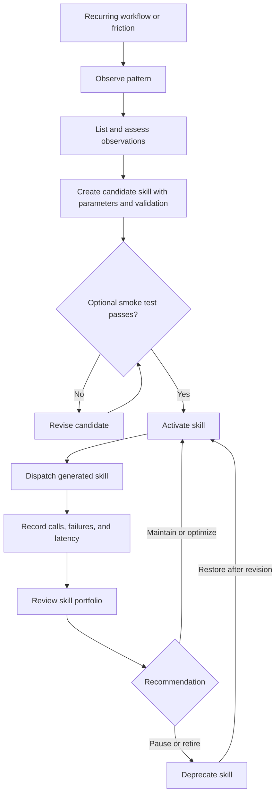

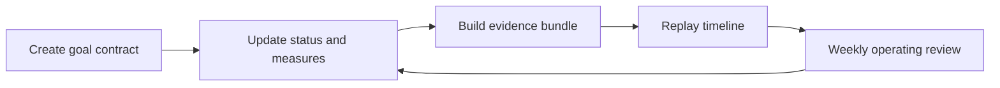

## 11. Knowledge, hosted tools, MCP, and research

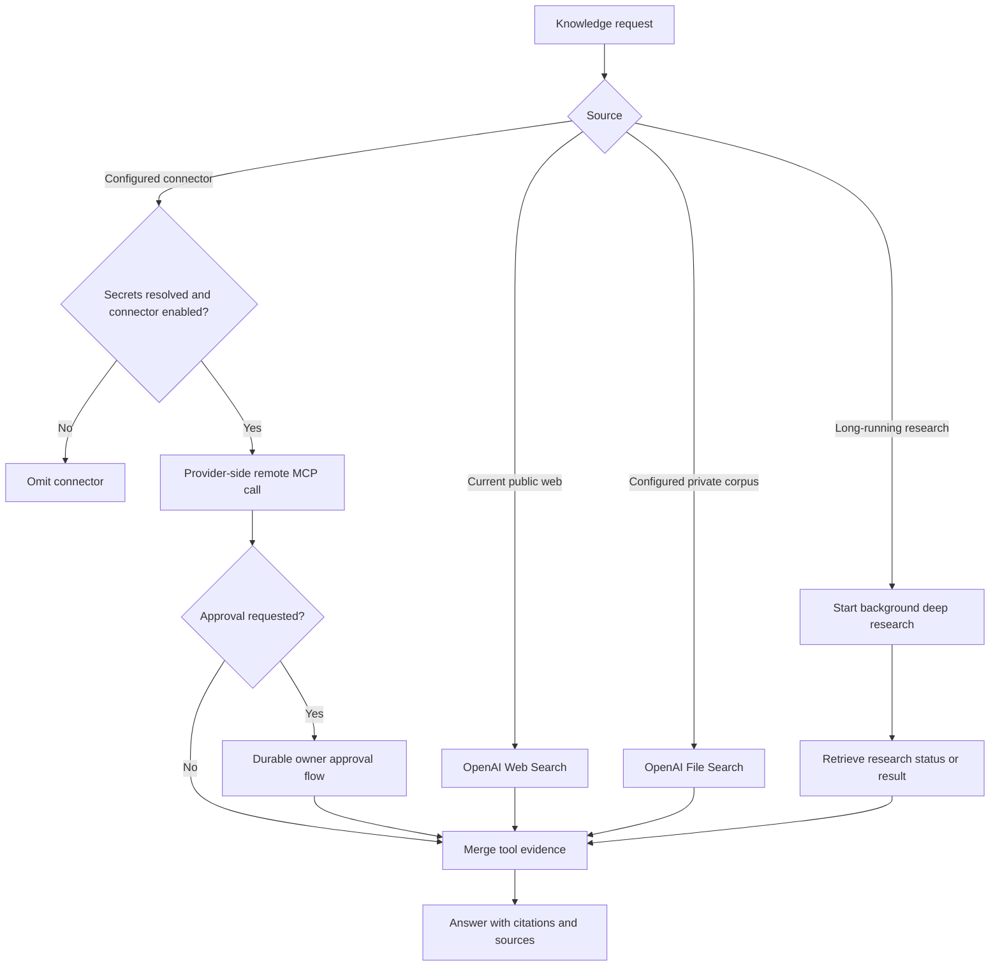

Operator-managed knowledge ingestion is deliberately separate from startup:

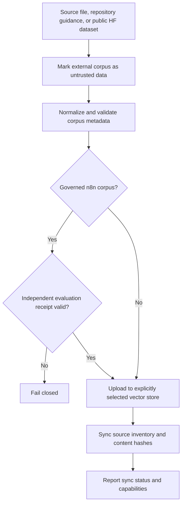

The standalone stdio servers follow bounded, read-oriented paths:

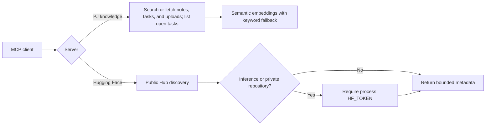

## 12. Utility and integration tools

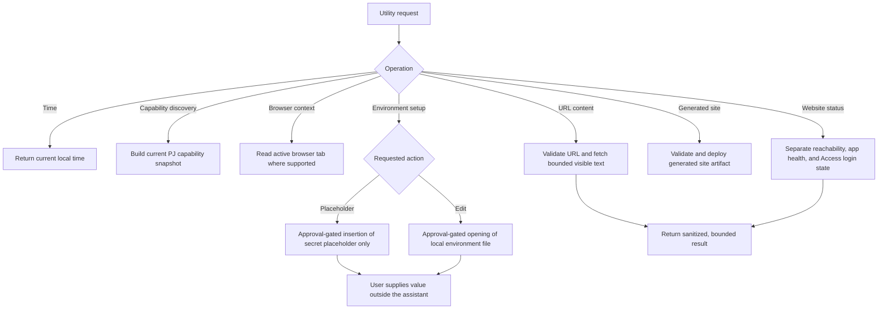

An HTTP 200 Cloudflare Access login page is reported as gated content, not as
proof that the protected application is healthy. Environment secret values
never pass through the assistant.

## 13. Realtime voice workflows

### Terminal voice

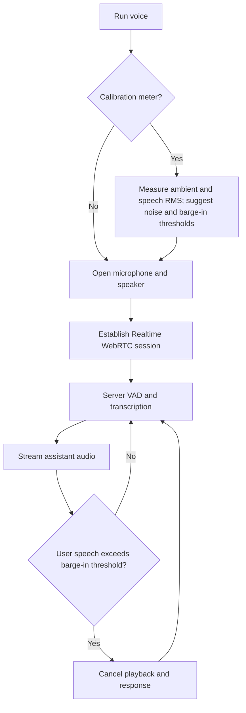

### Browser modes

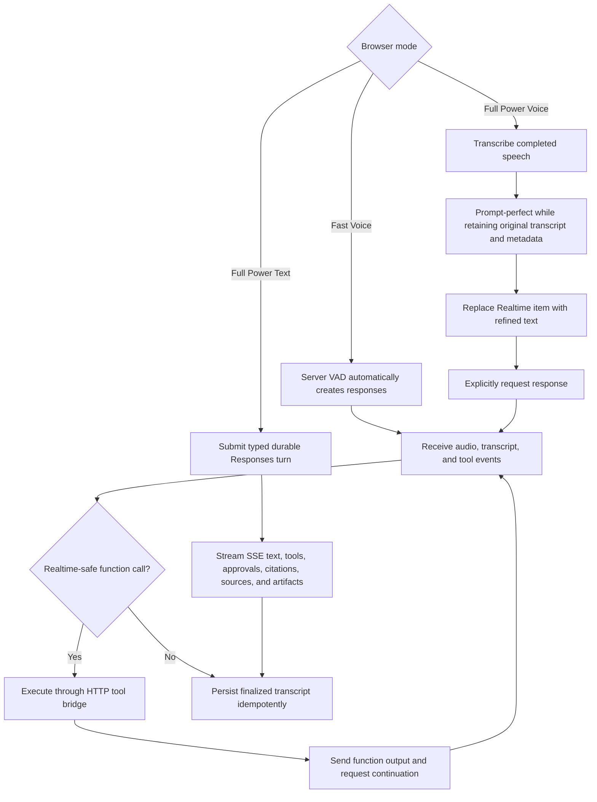

## 14. Browser, private runtime, and Cloudflare edge

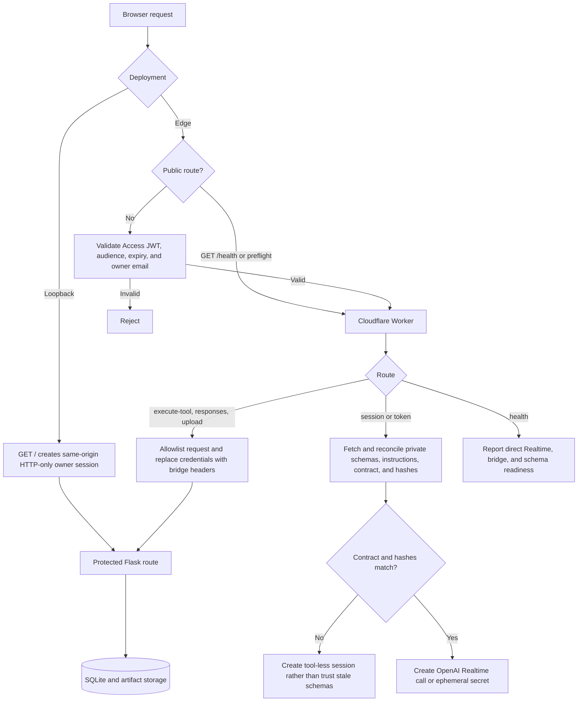

After signaling, WebRTC audio and the `oai-events` data channel connect
directly between the browser and OpenAI. HTTP tool calls, Full Power turns,
uploads, artifacts, and transcript persistence continue through the selected
API base. `POST /webhook` is unsupported, local-only legacy code and is not an
edge route.

### Signaling recovery

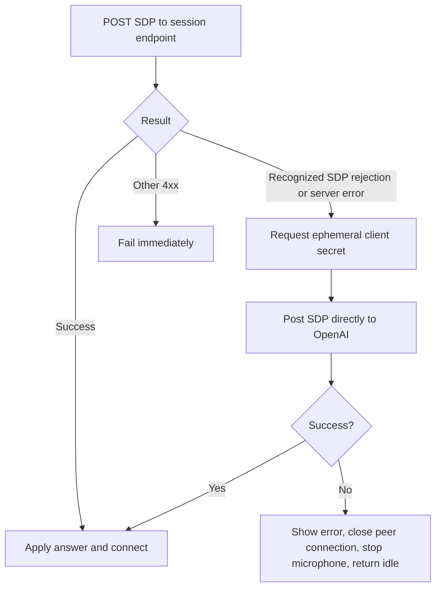

## 15. Configuration, observability, and operations

```mermaid
flowchart TD
    START[Process startup] --> BASE[Load config.json, instructions, MCP, policy, and Worker manifest]
    BASE --> PROFILE[Apply dev, staging, or prod profile overlay]
    PROFILE --> SHORT[Apply shorthand environment settings]
    SHORT --> JSON[Apply PJ_CONFIG_OVERRIDES]
    JSON --> TYPED[Apply typed PJ_CONFIG__SECTION__FIELD overrides]
    TYPED --> VALIDATE{Required profile values and types valid?}
    VALIDATE -->|No| CLOSED[Fail closed with configuration error]
    VALIDATE -->|Yes| SNAPSHOT[Expose immutable runtime configuration snapshot]
    SNAPSHOT --> RUN[Start selected runtime surface]
```

```mermaid
flowchart TD
    REQ[HTTP request or runtime operation] --> RID[Reuse valid client request ID or create UUID]
    RID --> CONTEXT[Bind request and session IDs to logging context]
    CONTEXT --> WORK[Perform operation]
    WORK --> LOG[Emit one metadata-only JSON object per line]
    LOG --> REDACT[Recursively redact credentials, headers, tokens, keys, and secret-shaped strings]
    REDACT --> RESP[Return bounded error or result with x-request-id]
    RESP --> INCIDENT{Operational issue?}
    INCIDENT -->|No| DONE([Complete])
    INCIDENT -->|Yes| RUNBOOK[Diagnose health, bridge, schema, provider, storage, and logs]
    RUNBOOK --> BACKUP[Back up local SQLite and artifacts before destructive recovery]
    BACKUP --> RECOVER[Apply recovery or rollback and verify health]
```

Deployment validation checks the Worker route allowlist, required variables,
declared remote secret names, schema synchronization, Cloudflare Access setup,
and private bridge readiness without reading secret values.

## 16. Process-mining optimization loop

The workflow diagrams above are the intended process model. PJ's process miner
uses the metadata-only structured log as an event log to discover how the
features behave in practice, compare common variants, and prioritize changes.
It never ingests prompts, arguments, results, bodies, authorization headers, or
secret values.

```mermaid
flowchart TD
    RUN[Users exercise terminal, browser, tool, upload, and Responses workflows] --> LOG[Metadata-only JSONL lifecycle events]
    LOG --> FILTER[Allowlist fixed activity names and correlation/timing/status fields]
    FILTER --> CASE[Correlate cases by request, upload, tool-call, then session ID]
    CASE --> DISCOVER[Discover variants and directly-follows transitions]
    DISCOVER --> MEASURE[Measure failure rate, mean and p95 latency, incomplete cases, and replays]
    MEASURE --> PRIORITY{Optimization signal}
    PRIORITY -->|Failure or incomplete case| RELIABILITY[High: stabilize and guarantee terminal outcomes]
    PRIORITY -->|High p95 latency| PERFORMANCE[Medium: remove waits and duplicate work]
    PRIORITY -->|Replay activity| RETRY[Low: retain exact-once protection and inspect retry source]
    RELIABILITY --> CHANGE[Change one governed workflow step]
    PERFORMANCE --> CHANGE
    RETRY --> CHANGE
    CHANGE --> TEST[Run CI and controlled rollout]
    TEST --> RUN
```

### Optimization targets by feature

| Feature workflow | Process-mining signal | Safe optimization | Guardrail retained |
| --- | --- | --- | --- |
| Responses and history | Continuation rejection, failed turns, incomplete cases | Validate continuation earlier and ensure leases/checkpoints close on every terminal path | Durable continuation and exclusive turn lease |
| Local tools | Tool failure rate, p95 duration, replay frequency | Fix the highest-failure tool first; profile slow dispatch; remove duplicate upstream submissions | Approval policy, timeout, and exact-once replay |
| Uploads | Rejection/failure variants and request p95 | Improve preflight feedback and isolate slow scanner/extraction stages | Per-file skip, credential/executable refusal, narrow parsing |
| Documents and presentations | Export tool p95 and failure variants | Cache deterministic intermediate rendering and surface validation issues before conversion | Immutable versions, finalization gate, and artifact verification |
| Images | Generation failures and long-tail duration | Fail faster on enablement, idempotency, and budget checks before provider work | Paid-generation gate and lineage |
| Code and delegation | Validation/delegation failures and latency | Prefer read-only analysis, narrow task scope, and run cheap validation before expensive checks | Approval, daily cap, sandbox, and network restrictions |
| Skills and strategy | Repeated skill failures and uncommon variants | Deprecate unreliable generated skills and revise candidates from observed telemetry | Candidate lifecycle and human review |
| Knowledge and MCP | Connector omission, approval loops, provider latency | Report unavailable connectors early and favor ready sources while preserving citations | Secret resolution and MCP approval |
| Realtime and edge | Signaling fallback variants, bridge failures, request p95 | Target the dominant failing boundary and avoid unnecessary fallback attempts | Access checks, schema reconciliation, and bounded recovery |

Run the miner against an operator-provided structured log:

```bash
python scripts/process_mining.py /path/to/pj.jsonl --output process-report.json
```

Optimization is evidence-driven: establish a baseline, change one step, rerun
the same checks, and compare the next report. The miner deliberately recommends
no automatic policy relaxation, side-effect replay, secret collection, or
payload logging.
